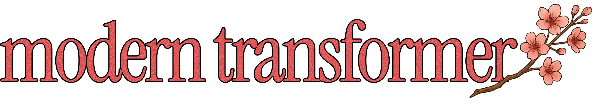

<div align="center">

<div align="center">
  
</div>

#

v1.0 | by rohan kalia

--- 

</div>

A <500 line performant PyTorch pretraining implementation with:
* BF16 precision
* RoPE
* Pre-RMSNorm
* SwiGLU
* Flash Attention
* Weight initialization
* Gradient accumulation
* Metal support (train on your macbook!)
* 850k tok/s on MacBook w/ Metal (M4 Pro, 48GB RAM)
* Distributed Data Parallel (DDP) support for GPU training


### Setup
```bash
# install uv if you haven't already (https://docs.astral.sh/uv/getting-started/installation/)
uv venv
source .venv/bin/activate
uv sync

# download data (optional; default path is data/tiny_shakespeare.txt)
uv run python scripts/download_tiny_shakespeare.py
```

### Logging
```bash
wandb login
# set your weights & biases account project and entity name in main.py and your api key in a .env file.
```

### Training
```bash
# on macbook:
uv run main.py --run my_run

# on GPU:
uv run torchrun --nproc_per_node=NUM_GPUS main.py --run my_run
```

### Checkpoint / Resume
```bash
# save checkpoint every 100 optimizer steps
uv run main.py --run my_run --checkpoint_every 100

# resume from checkpoint
uv run main.py --run my_run --resume checkpoint_step_100.pt
```

### Validation (optional)
```bash
uv run main.py --run my_run --val_ratio 0.05 --val_every 50
```

### Count params
```bash
uv run main.py --mode count_params
```

### Inference
```bash
uv run main.py --mode inference --checkpoint path/to/checkpoint_step_N.pt
```

### Presets
```bash
uv run main.py --run my_run --preset small   # 6 layers, 768d, 12 heads
# preset: tiny (2L), small (6L), base (12L)
```

### Testing
```bash
uv sync --extra dev && uv run pytest tests/ -v
```

### Options
- `--grad_norm 1.0` to enable gradient clipping
- `--qk_norm` for LLaMA-style QK RMSNorm
- `--use_flash2` to use Flash Attention 2 on CUDA